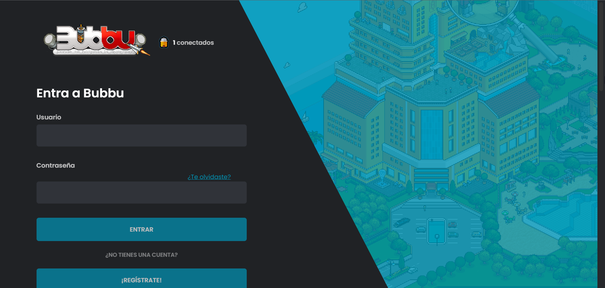
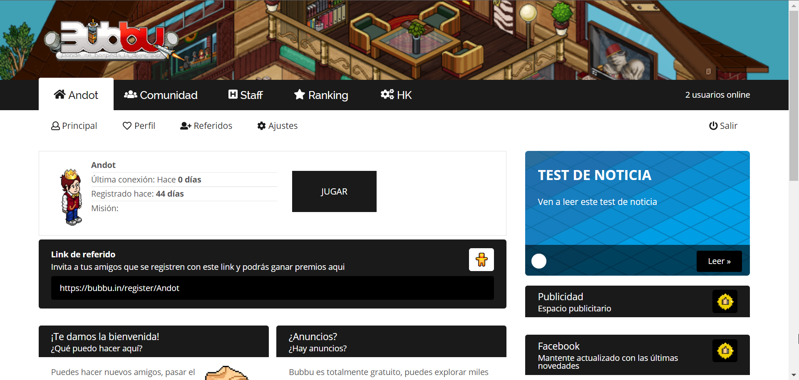
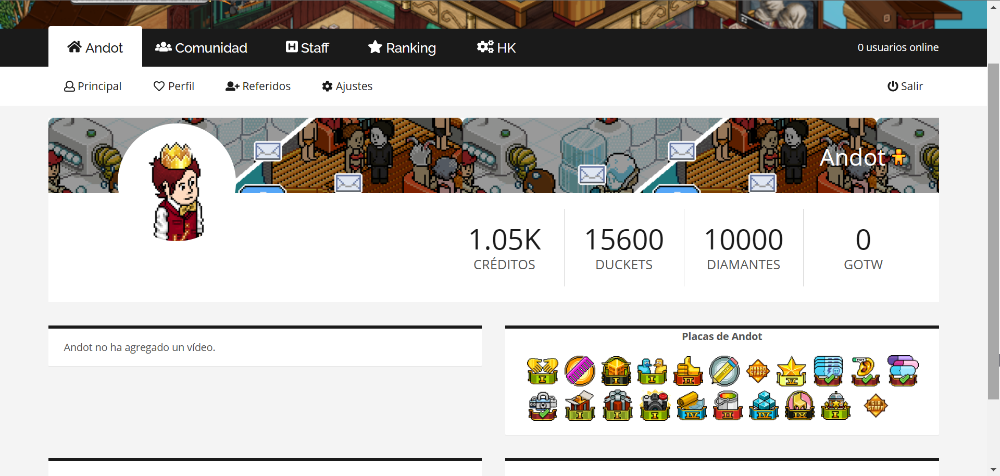

# 🌐 DimiCMS

DimiCMS, como su nombre indica, es una CMS (Content Management System) basada en Brain, para el emulador Arcturus.

## ✨ Características

- 🔐 **Registro/Inicio de sesión**

- 🏠 **Home**

- 👥 **Página Staff**  

- 🧑 **Perfil de usuario**

- 🏆 **Ranking**  

- 🖼️ **Galería**  

- 🛠️ **Housekeeping**  
