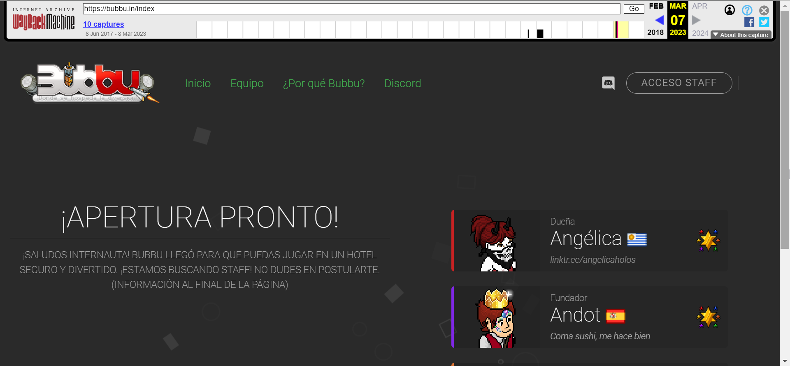
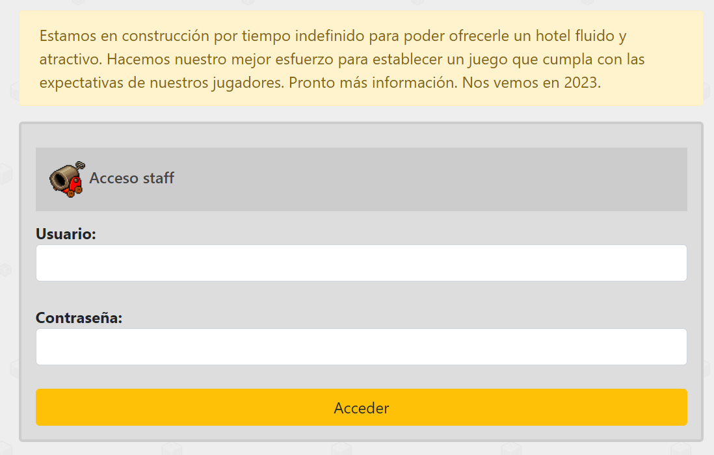
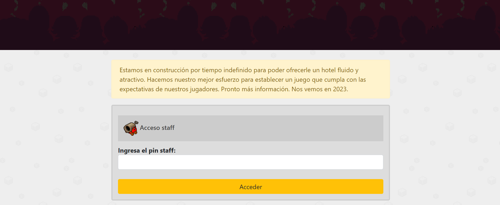
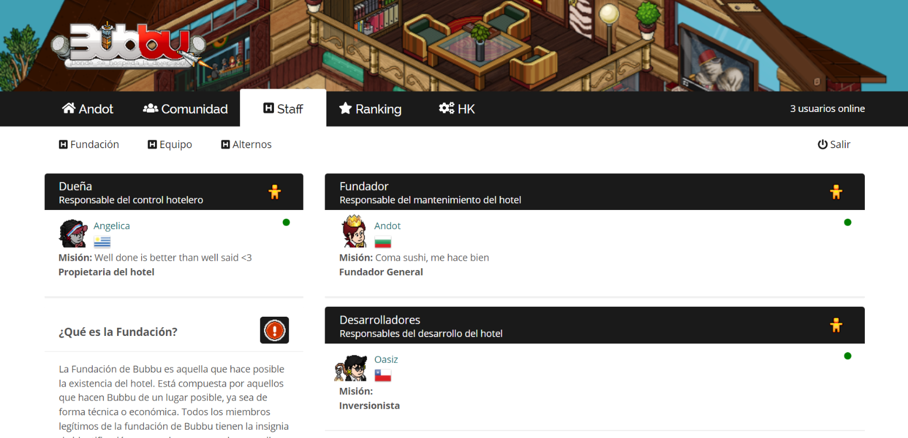
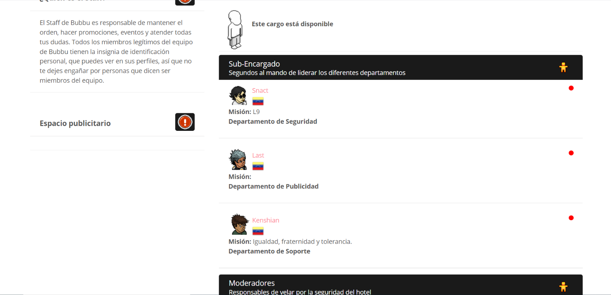
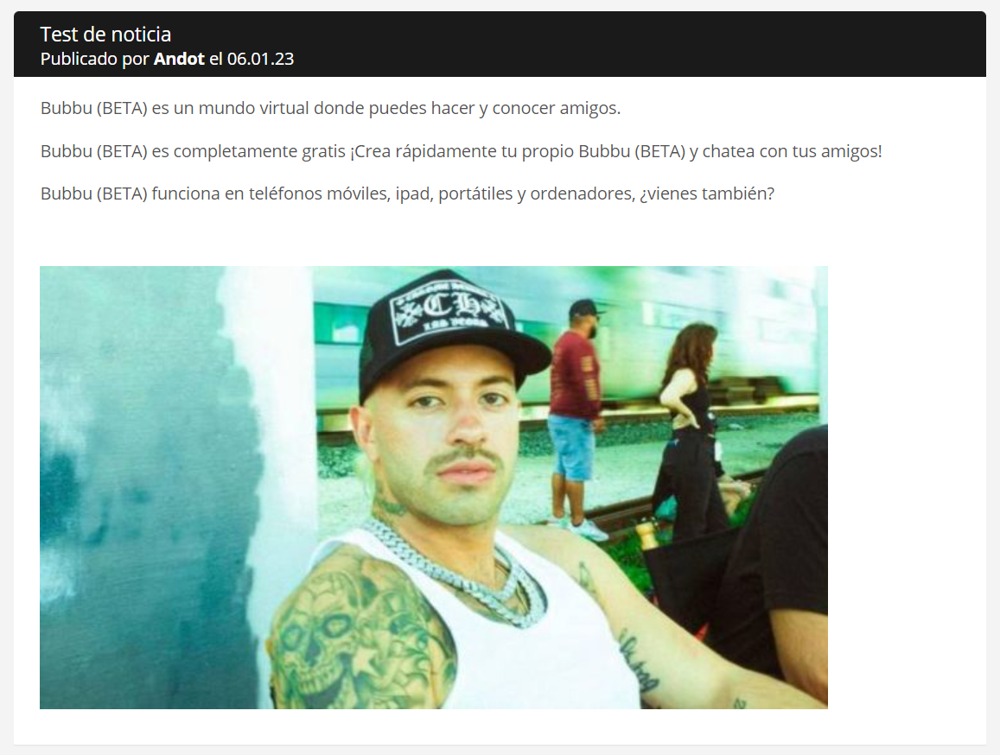

# 🌐 DimiCMS

DimiCMS, como su nombre indica, es una CMS (Content Management System) para el emulador Arcturus, utilizada en el proyecto Bubbu durante el año 2023.

## ✨ Características

- 🔐 **Registro/Inicio de sesión**
  

- 🔧 **Modo de mantenimiento (Acceso Staff)**

  

- 🏠 **Home**
  

- 👥 **Página Staff** (Personaje, indicador de online, bandera, misión, función)

- 🧑 **Perfil de usuario**
  

- 📰 **Noticias**
  

- 🏆 **Ranking**  

- 🖼️ **Galería**  

- 🛠️ **Housekeeping**
